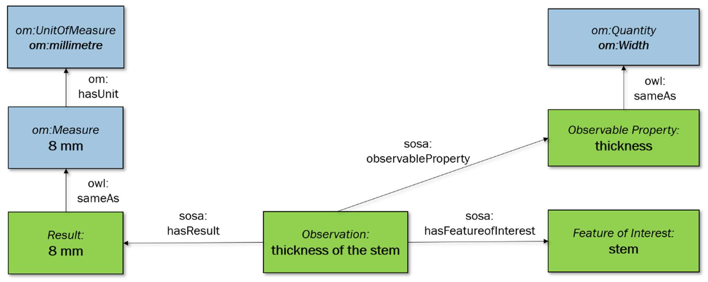

# Common Greenhouse Ontology

This project contains the Common Greenhouse Ontology (CGO) and the documentations about the ontology.

The Common Greenhouse Ontology is developed in the Dutch DDINGS project 
to capture the different data, constructional, and systemic elements used in a Greenhouse.
   
## Maintainers

Roos Bakker, TNO (roos.bakker@tno.nl)  
Romy van Drie, TNO (romy.vandrie@tno.nl)

## Repository

The ontology can be found in the folder [ontologies](./Ontologies).

## Best Practices

If you want to make changes to the ontology or other content in this repository, please read the [CGO manual](DDINGS%20Manual%20CGO.pdf)
and this readme first. If you want to make small changes:
1. checkout the dev branch 
2. bring it up to date with the master 
3. make your changes and document them in a commit message 
4. open a new merge request for merging your changes in the master 
5. One of the maintainers will approve the changes and merge 

For larger changes **create a new branch** and regularly commit with descriptive commit messages. If your changes are 
related to an issue, use #issuenumber (e.g. #7) to tag your issue in the commit message.

## CGO Description

Greenhouses are used to grow vegetables and plants year-round. The climate in the greenhouse
has a considerable influence on the growth of the crops. Therefore, it is important to optimally control
the climate. Increasingly more tools become available to help with this, such as a climate computer,
sensors, and other systems. All these systems produce different data, such as temperatures, crop
growth, weather statistics, which is stored in different databases. In this repository, you can find the
Common Greenhouse Ontology (CGO). It provides semantic alignment of different databases, as well
as a standard on high-tech greenhouses and their components.
The CGO was created in a national project Data-Driven Integrated Greenhouse Systems
(DDINGS). In this project, a platform was created to connect databases and perform data analysis [1].
In that work, we also introduced a first version of the CGO. Since then, we fully developed the CGO
with different modules, a broad set of classes that describe the components of greenhouses, and an
integration with other ontologies such as the Semantic Sensor Network ontology [2] and the Ontology
of units of Measure [3]

### Method

The CGO was developed with domain experts and focuses on greenhouse-related concepts and measurements. 
Several ontology development methods were consulted and applied at various stages of development, 
including SABiO [4], and Ontology 101 [5]. The CGO also makes use of other ontologies: 
the Semantic Sensor Network ontology (SSN), which includes the Sensor, Observation, Sample, 
and Actuator ontology (SOSA), and the Ontology of units of Measure (OM).

### Observations and measurements in CGO

Observations are an important aspect of the CGO. In the CGO, the SOSA ontology is used to
model observations. In Figure 1, a simplified version of SOSA’s architecture of observations is shown
in green. The example observation is the thickness of a stem (of a flower). The stem is the part that is
observed, the Feature of Interest. The property we are observing is its thickness, the Observable
Property. The Feature of Interest and the Observable Property, but also the result, are linked to the
Observation, the center of the architecture to which all elements are connected.

The Ontology of units of Measure (OM) is an OWL ontology for the domain of quantities,
measurements and units of measure [3]. OM provides the possibility to link aspects of an
observation to a quantity and a unit. A schematic overview of how this is implemented in CGO is
given in Figure 1. From a cgo:Class (e.g. thickness), a link to an om:Quantity (e.g. om:Width) can be
provided. The results are linked to a numerical value through om:NumericalValue (this is not shown
in Figure 1 for reasons of simplification) and to a unit through om:hasUnit.

### CGO main classes

The CGO contains 382 classes, 99 properties (both data and object properties), and 12
individuals.1 This includes the classes and properties from the SOSA ontology. We can divide the
content into four main categories: the greenhouse, which is the center concept of the ontology,
features, which are set properties of the greenhouse such as its dimensions, parts, which are the
objects that can be found in greenhouses, and finally, measurements. The measurements in the greenhouse are modelled 
using SOSA [2] and OM [3] as could be seen in Figure 1. SOSA classes are
connected to CGO classes by being superclasses of possible Features of Interest and Observable
Properties, OM classes are connected to data properties of CGO and as a subtype of sosa:Result.
Each of the categories contain a variety of classes. The parts category contains over 150 classes
and provides an elaborate, yet not complete, overview of parts of a high-tech greenhouse. Important
subsets are systems and construction hierarchies. The systems subset describes a wide set of systems
in a greenhouse ranging from broader ventilation systems to specific geothermal heat pumps. The
construction subset includes classes such as screens and ventilation vents. These classes are all
connected to the center of CGO, the greenhouse class, by the object property part of. As mentioned
above, measurements are modelled through SOSA, but features of the greenhouse such as its
orientation and location are expressed with data properties.

### Competency questions and SHACL constraints

For testing the completeness of the CGO, we created competency questions (CQ) in collaboration
with greenhouse experts. For querying, SPARQL queries were made from these CQ's, and restrictions were expressed using SHACL
constraints.

## Visualizing the ontology

A visualisation of the ontology gives a quick overview and can add to the understanding of the design choices 
described above. For displaying the ontology, first download the ontology to your device. Then go to the following link:

[webvowl semantic treehouse](https://webvowl.semantic-treehouse.nl/)

Upload the ontology by going to the tab ***Ontology*** in the toolbar at the bottom of your screen. 
 Click ***select ontology file***, and select the CGO ontology.  

For editing the ontology for reuse we recommend using Protégé or Topbraid.

## Documentation

For more development information on how to find and add concepts to the CGO, checkout the [CGO manual](DDINGS%20Manual%20CGO.pdf). 
For a more elaborate theoretical description, read our paper on the CGO (submitted) [7].

## Team

#### Greenhouse experts
Athanasios Sapounas, TNO  
Bart Slager, TNO

#### Developers
Roos Bakker, TNO  
Romy van Drie, TNO  
Barry Nouwt, TNO  
Cornelis Bouter, TNO  
Han Kruiger, TNO  
Ellen van Bergen, TNO  
Sander van Leeuwen, WUR  
Lorijn van Rooijen, WUR  

#### Advisers
Jack Verhoosel, TNO  
Jan Top, WUR

## References

1. Verhoosel, J.P.C.; Nouwt, B.; Bakker, R.M.; Sapounas, A.; Slager, B. A Datahub for Semantic Interoperability
in Data-Driven Integrated Greenhouse Systems. EFITA conference 2019.
2. Neuhaus, H.; Compton, M. The semantic sensor network ontology. AGILE workshop on challenges in geospatial
data harmonisation, Hannover, Germany. 2009.
3. Rijgerberg, H.; Wigham, M.L.I.; Top, J.L. How semantics can improve engineering processes: A case of units
of measure and quantities. Adv. Eng. Inform 2011, 25, 276-287.
4. de Almeida Falbo, R. Experiences in using a method for building domain ontologies. The 16th International
Conference on Software Engineering and Knowledge Engineering, SEKE. 2004.
5. Noy, N.; McGuinness, D. Ontology development 101: A guide to creating your first ontology. Development
2001, 32, 1-25.
6. Bouter, C.; Kruiger, H.; Verhoosel, J. Domain-Independent Data Processing in an Ontology Based Data
Access Environment using the SOSA Ontology, Demonstration track of the 2021 Formal Ontology in
Informations Systems Conference, 2021, Submitted.
7. Bakker, R.M.; van Drie, R.A.N.; Bouter, C.A.; van Leeuwen, S.; van Rooijen, L.; Top, J. The Common Greenhouse Ontology: an ontology
describing components, properties, and measurements inside the greenhouse. EFITA conference 2021, submitted

# License 

CGO is released under Apache 2.0, for more information see the LICENSE.

